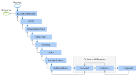
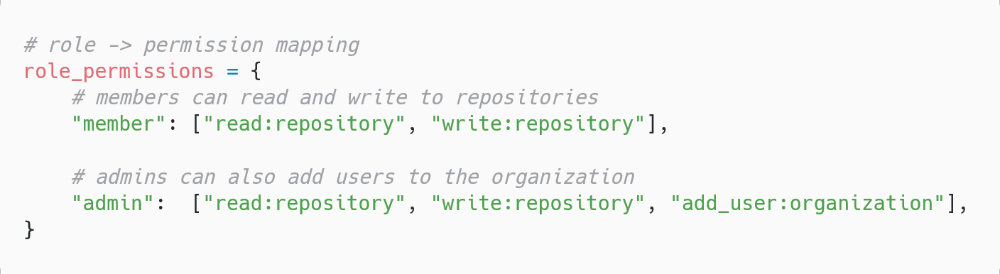
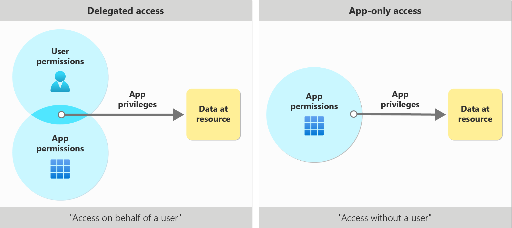
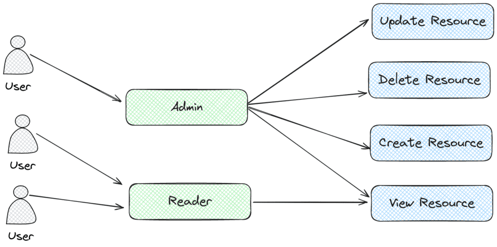

# Http4sJwtPermissions


This project is an http4s middleware much `express-jwt-authz` and `express-jwt-permissions` used to authorize access to an endpoint
`express-jwt` is used together with `express-jwt-authz` to both validate a jwt and make sure it has the correct permissions to call the endpoint. After successfully validating a jwt, `express-jwt` adds a user object to the request passes it to the next action. 

using ``http4sJwtPermissions`, we still need to have validated the jwt before this middleware. Here we also validate the jwt twice as there is no easy way to pass more info into the request


## Usage
```scala
 class TestRoutes(jwtService: JWTService[IO]) extends Http4sDsl[IO] {
    val routes = AuthedRoutes.of[User, IO] {
      case req -> Root / "hello" as user => Ok()
    }

     val allRoutes: HttpRoutes[IO] = CheckPermissionsMiddleware(
      jwtService,
      Set("read:user", "write:user", "delete:user")
    ).apply(routes)
  }

  val jwtService = JWTServiceLive.make[IO](jwtConfig, clock)

  val routes: HttpRoutes[IO] = new TestRoutes(
    jwtService
  ).allRoutes

```


## Test
run `sbt test` or `sbt --client test` on the terminal to run the tests

### Http 
some sites return a 404 (not found) error instead of a 403 error when a user is not authorized to access (or perform an operation on) a resource. 
The primary purpose of doing so is to hide the existence of the resource from the user instead of letting the user know the resource exists but they are unable to perform the requested operation. 
This practice is called error encapsulation, and we can see it implemented with 5xx errors when a 500 error is replaced with a 503 error to avoid informing potential attackers that an internal server error occurred

use 404 instead of 403

Letting the client (and especially the user behind it) know that resource exists could possibly lead to Insecure Direct Object References (IDOR), an access control vulnerability based on the knowledge of resources you shouldn't access. Therefore, in these cases, your API should respond with a 404 Not Found status code

An origin server that wishes to "hide" the current existence of a forbidden target resource MAY instead respond with a status code of 404 (Not Found).

Response(status=401, httpVersion=HTTP/1.1, headers=Headers(Content-Length: 0, WWW-Authenticate: Bearer scopes= realm="read:user write:user delete:user"))


Privileges define actions which can be performed against specific functionality. Privileges can be only be assigned to roles.
i.e. `nexus:blobstores:create,read` means allow creating and reading blobstores

Actions are functions allowing an explicit behavior the privilege can perform with the associated function.
You must assign one or more actions when creating new privileges

```bash
#Consider how each action behaves when applied to a privilege type:

add

#This action allows privileges to add repository content or scripts.

browse

#This action allows privileges to view the contents of associated repositories. Unlikeread, privilege types withbrowse can only view and administrate repository contents from UI.

create

#This action allows privileges to create applicable configurations within the repository manager. Since a read permission is required to view a configuration, this action is associated with most existing create privileges.

delete

#This action allows privileges to delete repository manager configurations, repository contents, and scripts. A read action is generally associated with delete actions, so the actor can view these configurations to remove them.

edit

#This action sllows privileges to modify scripts, repository content and settings.

read

#This action allows privileges to view various configuration lists and scripts. Withoutread, any associated action will permit a privilege to see these lists but not its contents. The read action also allows privileges to utilize tools that can look at content from the command line.

update

#This action allows privileges to update repository manager configurations. Most existing privileges with update include read actions. Therefore, if creating custom privileges with update, the actor should consider adding read to the privilege in order to view repository manager configuration updates.

*

#This action is a wildcard giving you the ability to group all actions together. Using a wildcard applies all other applicable actions to the privilege.


```

others(GitHub) see permissions as actions


- Roles represent a collection of permissions or privileges that define what actions a user can perform.
- Users are assigned one or more roles, and their access rights are determined based on the permissions associated with those roles


A permission is the declaration of an action that can be executed on a resource.
Permissions are bound to a resource
 
Privileges are assigned permissions
When you assign a permission to a user, you are granting them a privilege. If you assign a user the permission to read a document, you are granting them the privilege to read that document
Resources expose permissions, users have privileges( privileges can also be assigned to applications)

The entity that protects the resource is responsible for restricting access to it, i.e., it is doing access control

Scopes enable a mechanism to define what an application can do on behalf of the user
(delegated access)
Typically, scopes are permissions of a resource that the application wants to exercise on behalf of the user.

Usually, the scopes granted to a third-party application are a subset of the permissions granted to the user
when the application excercises its scopes, the user must have the corresponding priviledge at that time. The application can't do more than the user can do

Scopes only come into play in delegation scenarios, and always limit what an app can do on behalf of a user: a scope cannot allow an application to do more than what the user can do. They are not meant to grant the application permissions outside of the privileges the delegated user already possesses

In auth0, a role is a collection of permissions

Scopes are not required when requesting an access token for an API configured with RBAC.Only the audience must be passed to Auth0


`create:items`: Create menu items

`update:items`: Update menu items

`delete:items`: Delete menu items

`action:resource` is the format for permissions
You need to associate the permissions you've created with this role, mapping it to your API's resources
Through its permissions claim, the access token tells the server which actions the client can perform on which resources.

A scope is a term used by the OAuth 2.0 protocol to define limitations on the amount of access that you can grant to an access token. In essence, permissions define the scope of an access token.

[role-based-authentication-](https://thecibrax.com/role-based-authentication-for-net-core-apis-with-auth0)
[Permissions, Privileges and Scopes](https://www.youtube.com/watch?v=vULfBEn8N7E)
[Permissions, Privileges and Scopes](https://auth0.com/blog/permissions-privileges-and-scopes/)
### In database
A privilege is a permission to perform an action or a task
Privileges may be granted to individual users, to groups, or to PUBLIC. PUBLIC is a special group that consists of all users, including future users. Users that are members of a group will indirectly take advantage of the privileges granted to the group, where groups are supported.

sessioncookie




the order in which the middleware components are invoked on requests and the reverse order for the response

CORS before authentication, before authorization


RBAC is a model of access control in which access is granted or denied based upon the roles assigned to a user. Permissions are not directly assigned to an entity; rather, permissions are associated with a role and the entity inherits the permissions of any roles assigned to it. Generally, the relationship between roles and users can be many-to-many, and roles may be hierarchical in nature.


A role is simply a way to group permissions so that they can be assigned to users
When a user is assigned to a role, the user will be granted all the permissions that the role has.

A permission specifies an action that a user can take on a resource. For example, we might say that a user in an organization has permission to read repositories.




Access Control (or Authorization) is the process of granting or denying specific requests from a user, program, or process. Access control also involves the act of granting and revoking those privileges.

Role-Based Access Control (RBAC) is the primary authorization mechanism in Kubernetes and is responsible for permissions over resources. These permissions combine verbs (get, create, delete, etc.) with resources (pods, services, nodes, etc.) and can be namespace or cluster scoped

```bash
addCommandAlias("cleanCompile", "clean; compile;")
addCommandAlias("cleanTest", "clean; test;")
addCommandAlias("testWithCoverage", "clean; coverageOn; test; coverageAggregate; coverageOff; viewCoverageResults;")
```

A permission describes the ability to perform an action on a resource. For example, a document can be viewed, edited, and deleted.

Permissions can be assigned to users. When you assign a permission to a user, you are granting that user that privilege for a specific resource, or set of resources

Users are granted access by having permissions assigned to their identity. It's very common that permissions are grouped into roles, and those can be assigned to users. This is known as the role-based access control model. For example, we can imagine a blogging website where a user can view a post, a moderator can view and edit a post and an admin can view, edit and delete a post.


#### Scope explosion
Applications grow to have many types of resources, and each of these resources (documents, reports, projects, repositories) support a few different operations (create, read, update, delete, list). A fine-grained permission system often creates a cartesian product of these resource/operation tuples, resulting in dozens (or hundreds) of scopes. Injecting all of these scopes into a JWT isn’t possible, since the HTTP authorization header will exceed size limits.

every user in the system should be granted the minimum privileges required to perform their duties (i.e. just-enough access)

RBAC is a popular authorization model where permissions are aggregated into roles that are assigned to users or groups

Role-Based Access Control (RBAC) describes the practice of aggregating discrete application permissions into a small set of roles, and assigning those roles to users or groups

scopes are for applications while permissions are for users
Developers should always abide by the principle of least privilege, asking for only the permissions they need for their applications to function.

In OAuth 2.0, these types of permission sets are called scopes. They're also often referred to as permissions. In the Microsoft identity platform, a permission is represented as a string value. An app requests the permissions it needs by specifying the permission in the scope query parameter. Identity platform supports several well-defined OpenID Connect scopes and resource-based permissions (each permission is indicated by appending the permission value to the resource's identifier or application ID URI). For example, the permission string https://graph.microsoft.com/Calendars.Read is used to request permission to read users calendars in Microsoft Graph.

[oauth2-scopes-are-not-permissions](https://www.aserto.com/blog/oauth2-scopes-are-not-permissions)
[authorization](https://www.aserto.com/blog/fine-grained-authorization-whats-all-the-buzz-about)
[isn'tauthorization-part-of-authentication](https://www.aserto.com/blog/isnt-authorization-part-of-authentication)
[scopes-vs-permissions-authorization](https://www.aserto.com/blog/scopes-vs-permissions-authorization)

```bash
> scala-cli .
# OR
> scala-cli . --platform jvm
```

use api gateway for advanced security


The application can use delegated access, acting on behalf of a signed-in user, or app-only access, acting only as the application's own identity.




### Delegated access (access on behalf of a user)
In this access scenario, a user has signed into a client application. The client application accesses the resource on behalf of the user. Delegated access requires delegated permissions. Both the client and the user must be authorized separately to make the request
For the client app, the correct delegated permissions must be granted. Delegated permissions can also be referred to as scopes. Scopes are permissions for a given resource that represent what a client application can access on behalf of the user

For the user, the authorization relies on the privileges that the user has been granted for them to access the resource.


### App-only access (Access without a user)
In this access scenario, the application acts on its own with no user signed in. Application access is used in scenarios such as automation, and backup. This scenario includes apps that run as background services or daemons. It's appropriate when it's undesirable to have a specific user signed in, or when the data required can't be scoped to a single user
App-only access uses app roles instead of delegated scopes. When granted through consent, app roles may also be called applications permissions. The client app must be granted appropriate application permissions of the resource app it's calling. Once granted, the client app can access the requested data


### Types of permissions
- Delegated permissions are used in the delegated access scenario. They're permissions that allow the application to act on a user's behalf. The application will never be able to access anything the signed in user themselves couldn't access.

For example, take an application that has been granted the Files.Read.All delegated permission on behalf of the user. The application will only be able to read files that the user can personally access.
- Application permissions, also known as app roles, are used in the app-only access scenario, without a signed-in user present. The application will be able to access any data that the permission is associated with.


### Consent
One way that applications are granted permissions is through consent. Consent is a process where users or admins authorize an application to access a protected resource. For example, when a user attempts to sign into an application for the first time, the application can request permission to see the user's profile and read the contents of the user's mailbox


### How does delegated access work?
The most important thing to remember about delegated access is that both your client app and the signed-in user need to be properly authorized. Granting a scope isn't enough. If either the client app doesn’t have the right scope, or the user doesn’t have sufficient rights to read or modify the resource, then the call will fail.

Role-based access control (RBAC) allows certain users or groups to have specific permissions to access and manage resources

OAuth 2.0 is a method through which a third-party app can access web-hosted resources on behalf of a user.

In advanced RBAC implementations, roles may be mapped to collections of permissions, where a permission describes a granular action or activity that can be performed. Roles are then configured as combinations of permissions. Compute the overall permission set for an entity by combining the permissions granted to the various roles the entity is assigned.


## What are OAuth Scopes for?
OAuth scopes serve as permissions in the OAuth 2.0 framework, defining the level of access an application has to a user's account. Each scope represents a specific action, like reading emails or managing files

However, OAuth scopes were never designed to be a comprehensive authorization mechanism. They provide a way to limit access but not to specify or enforce detailed user permissions within an application. This distinction is often overlooked, leading to misuse and potential security risks​​.


fine-grain access
If you put a read:document scope in an access token. The application can look at the scope and say okay the user can read the document,but which document?, all documents?


### Scopes are not Permissions
OAuth2 tokens have a scope. The scope is usually something like read:user or profile:write. The OAuth2 scope does not say what a user can and cannot do.

OAuth is not suitable for user authorization. The fact that you have an access token that allows you to act on the user’s behalf does not mean that the user can perform an action. 

An access token represents that the client application has been authorized by the user. It states what a user said (consent!) a third party application can do in their name. Let's take a quick look at the OAuth2 flow:

1. The client application asks the user if they can access a protected resource on their behalf (by redirecting the user to the authorization server’s authorization endpoint, specifying exactly what they would like to access (scopes)).
2. The user identifies themselves to the authorization server (but remember, OAuth is not authentication; you’ll need OpenID Connect to help you with that).
3. The user authorizes the client application to access the protected resource on their behalf (using the OAuth consent process).
4. The client application is issued an access token.
For example:

Alice allows myphotoapp to access her Facebook photos.
Bob allows mytodolist to access his Google Calendar.
Let's make a counterexample:

If Alice would allow myphotoapp to act as an administrator of the system and delete the production database, it would not matter unless Alice is actually a system administrator. Similarly, Alice can not allow myphotoapp access to Bob's pictures, because she is not Bob.

While OAuth is not user authentication, it does require the user to authenticate and consent to the client application’s authorization request. The user must prove their identity in order to delegate access.

Client Authorization (Delegation)
OAuth is an authorization protocol, but maybe a better name for it is a delegation protocol. It is a protocol that allows a client application to request permission to access a protected resource (API) on the resource owner’s (the user’s) behalf.

a response mode of form_post, as this allows us to keep codes out of the URL and protected via TLS.  


```bash
 HTTP/1.1 401 Unauthorized
  WWW-Authenticate: Bearer realm="example",
                    error="insufficient_authentication_level",
                    error_description="A different level of authentication is required",
                    acr_values="http://schemas.openid.net/pape/policies/2007/06/multi-factor"
                    
 ```


SHA-256 will produce a 256-bit hash, while SHA-512 will produce a 512-bit hash.

The level of security each one gives you is 50% of their output size, so SHA-256 will provide you with 128-bits of security, and SHA-512 will provide you with 256-bits of security. This means that an attacker will have to generate 2^128 hashes before they start finding collisions


```bash
# generate a private key with the correct length
openssl genrsa -out private-key.pem 3072

# generate corresponding public key
openssl rsa -in private-key.pem -pubout -out public-key.pem
#Now that you have a private key, you can use it to generate a self-signed certificate.
# optional: create a self-signed certificate
openssl req -new -x509 -key private-key.pem -out cert.pem -days 360

# optional: convert pem to pfx
openssl pkcs12 -export -inkey private-key.pem -in cert.pem -out cert.pfx

```
Creating an RSA Public Key from a Private Key Using OpenSSL
Now that you have your private key, you can use it to generate another PEM file, containing only your public key.

```bash
openssl rsa -in private-key.pem -pubout -out public-key.pem
```
[oauth-is-not-user-authorization](https://www.scottbrady91.com/oauth/oauth-is-not-user-authorization)
[how-to-use-oauth-scopes-for-authorization](https://www.permit.io/blog/how-to-use-oauth-scopes-for-authorization)
[delegated-access](https://learn.microsoft.com/en-us/entra/identity-platform/delegated-access-primer)

[client-authentication](https://www.scottbrady91.com/oauth/client-authentication)


Identity Tokens and OIDC Authentication
An identity token describes the authentication event that took place at the identity provider. It contains information such as when the user last authenticated and how they authenticated. An identity token is always a signed JSON Web Token (JWT).

UserInfo Endpoint
The user info endpoint is a new API exposed by the identity provider. It allows applications to use an access token to discover identity data about the use

The user info endpoint has its own set of scopes that authorize application’s to receive specific claim types about the user. For example, if the application is authorized to use the profile scope, then it can receive the user’s name, date of birth, and username from the user info endpoint.

scopes are typically modeled as resources, which come in two flavors: identity and API.

An identity resource allows you to model a scope that will permit a client application to view a subset of claims about a user. For example, the profile scope enables the app to see claims about the user such as name and date of birth.

An API resource allows you to model access to an entire protected resource, an API, with individual permissions levels (scopes) that a client application can request access to.

A scope is a permission  to do something  within a protected resource on behalf of the resource owner


SSO establishes trust between the identity provider (IdP) and the service provider (SP). The IdP handles the identity information that authenticates the user requesting SSO, and the SP handles the service or application that the user wants to access.
 

Identity standards such as SAML, OAuth2, and OpenID Connect enable the secure sharing of identity data among multiple SPs and IdPs

### Client
A client is a piece of software that requests tokens from your IdentityServer - either for authenticating a user (requesting an identity token) or for accessing a resource (requesting an access token). A client must be first registered with your IdentityServer before it can request tokens and is identified by a unique client ID
[openid-connect-overview](https://www.scottbrady91.com/openid-connect/openid-connect-overview)


Authorization, often referred to as access control, is the process of granting or denying access permissions to authenticated users or entities based on their identity, roles or attributes. It answers the question, "What are you allowed to do?"

Authorization methods include:


- Role-Based Access Control (RBAC): Users are assigned roles, and each role has specific permissions. Users inherit the permissions associated with their roles.
- Attribute-Based Access Control (ABAC): Access is determined based on attributes of the user, resource and environment. For example, access might be granted if the user's department matches the resource's department.
- Discretionary Access Control (DAC): Access control is at the discretion of the resource owner. Resource owners can grant or deny access to specific users.


[](https://access.redhat.com/documentation/en-us/red_hat_enterprise_virtualization/3.6/html/technical_reference/virtual_network_interface_controller_vnic)

A NIC provides a computer with a dedicated, full-time connection to a network. It implements the physical layer circuitry necessary for communicating with a data link layer standard, such as Ethernet or Wi-Fi. Each card represents a device and can prepare, transmit and control the flow of data on the network.

IP addresses belong to networks, not to the devices attached to those networks
core routers only care about the network id
networknid, subnetid and host id
The purpose of the mask or the part that is all 1s is to tell a router what part of an IP address is the subnetid
 for a class A, the network id is the first octet, for a class B, the first octets and for a class C, the first three

 Gateway routers serve as the entry or exit to each network


 The numbers in the remaining octet with a coressponding 1 in the subnet mask are the subnet id
 the numbers in the remaining octets that have a corresponding 0 in the host id

 the size of each subnet is entirely defined by its subnet mask

 [](interfaces.foreach(i=>println(i.isUp())))


 Role-based access control is a security model that grants application users access based on predefined permissions. System admins can assign and validate these permissions to particular resources upon an access attempt. To help manage permissions, they create roles to group them:

 

 The certificate is the way to share the public key


 ### Passkey

 A passkey is a FIDO credential stored on your computer or phone and it is used to unlock your online accounts.It works using public key cryptography and proof that you own the credential is only shown to your online account when you unlock your phone
### How FIDO Works
 FIDO authentication uses standard public key cryptography techniques to provide phishing-resistant authentication. During registration with an online service, the user’s client device creates a new cryptographic key pair that is bound to the web service domain. The device retains the private key and registers the public key with the online service. These cryptographic key pairs, called passkeys, are unique to every online service. Unlike passwords, passkeys are resistant to phishing, are always strong, and are designed so that there are no shared secrets

 ### How Authentication Works with FIDO

With FIDO, the user’s device must prove possession of the private key by signing a challenge for sign-in to be completed. This can only occur once the user verifies the sign-in locally on their device, via quick and easy entry of a biometric, local PIN or touch of a FIDO security key. Sign-in is completed via a challenge-response from the user device and the online service; the service does not see or ever store the private key. 

FIDO is designed from the ground up to protect user privacy and prevent phishing. Every passkey is unique and bound to the online service domain. The protocols do not provide information that can be used by different online services to collaborate and track a user across the services. Biometric information, if used, never leaves the user’s device.

### Enrollment and Sign-in with FIDO 
#### Enrolling a Passkey with an Online Service 

User is prompted to create a passkey 
User verifies the passkey creation via local authentication method such as biometrics, local PIN or touching their FIDO security key 
User’s device creates a new public/private key pair (passkey) unique for the local device, online service and user’s account.
Public key is sent to the online service and associated with the user’s account. Any information about the local authentication method (such as biometric measurements or templates) never leave the local device.

#### Using a Passkey for Subsequent Sign-in 
User is prompted to sign in with a passkey
User verifies the sign in with passkey via local authentication method such as biometrics, local PIN or touching their FIDO security key 
Device uses the user’s account identifier provided by the service to select the correct key and sign the service’s challenge. 
Client device sends the signed challenge back to the service, which verifies it with the stored public key and signs-in the user